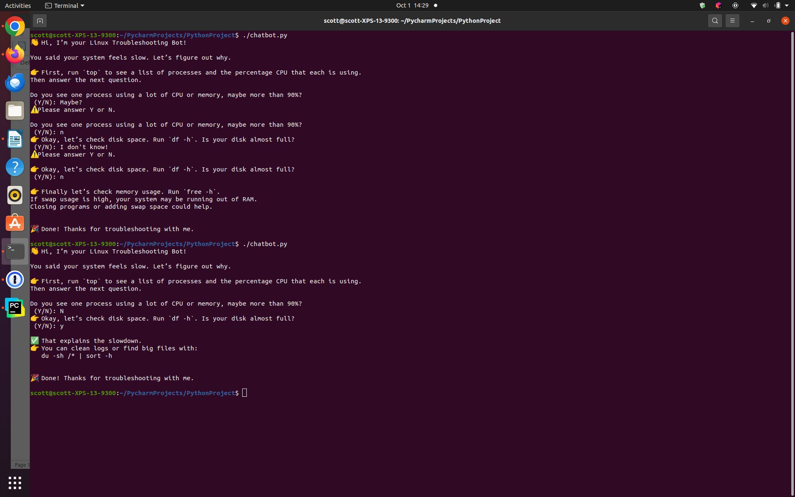

# 🤖 Linux Chatbot Demo
*A simple chatbot that helps troubleshoot common Linux performance issues.*

## 🚀 Features
- Guides user through performance troubleshooting  
- Uses a recursive decision tree structure  
- Lightweight command-line interface  

## 🛠️ Installation
```bash
git clone https://github.com/scottdieringer/Linux_Chatbot.git
cd Linux_Chatbot
python3 chatbot.py
```

## Chatbot in action

# Screenshot shows chatbot in action with two user input error scenarios.

