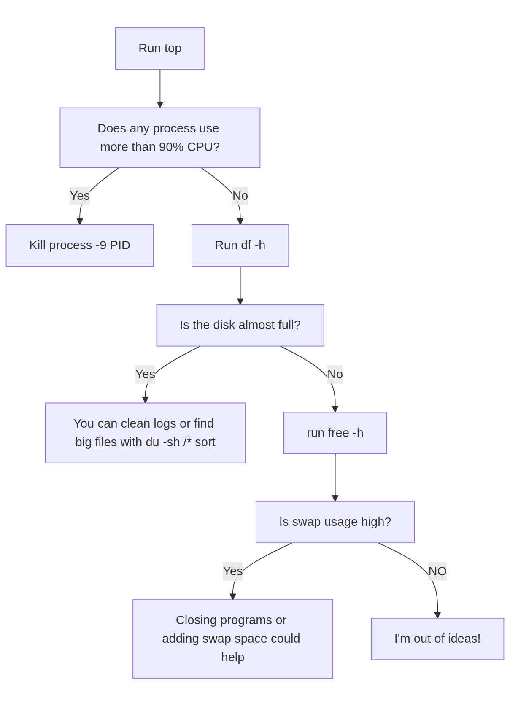

## Design Choices

- Tree-Based Structure:  
  Each node represents a question or answer. Leaf nodes provide advice; intermediate nodes guide the diagnostic flow.

- Recursive Traversal:  
  Keeps code clean and readable.

- Guidance Before Questions:  
  Users are instructed to run a certain Linux command before answering. This makes the bot both educational and actionable.

- Interactive Yes/No Prompts:  
  Validates input to accept only Y/N (case-insensitive). Ensures predictable flow through the troubleshooting tree.  If the user inputs
  anything other than a Y/y or N/n then the question is asked again.

---

## Technical Implementation

- Node-Based Design:  
  Each node contains either a question with possible answers or a final piece of advice.

- Recursive Traversal:  
  The chatbot starts at the root node and keeps asking questions until it reaches an answer node. If the user enters something invalid, it asks again.

---

## Challenges

- Validating input so only Y/N is accepted.  
- Combining guidance nodes (tell user what to run) with question nodes in a clean way.  
- Designing the tree to be easily extensible without nested conditionals.  
- Keeping the conversation natural while staying technical.

---

## Future Improvements

- Multi-topic support: networking, file finding, package management, etc.  
- Dynamic guidance: tailor commands based on the user’s Linux distribution.  
- Run diagnostics internally: execute system commands and parse results.  
- Improved UI: colorized output, menus, or logs of troubleshooting steps.  
- Natural language input: allow more flexible user responses beyond strict Y/N.  
- Logging and help: keep a session log and provide explanations for suggested commands.

---

